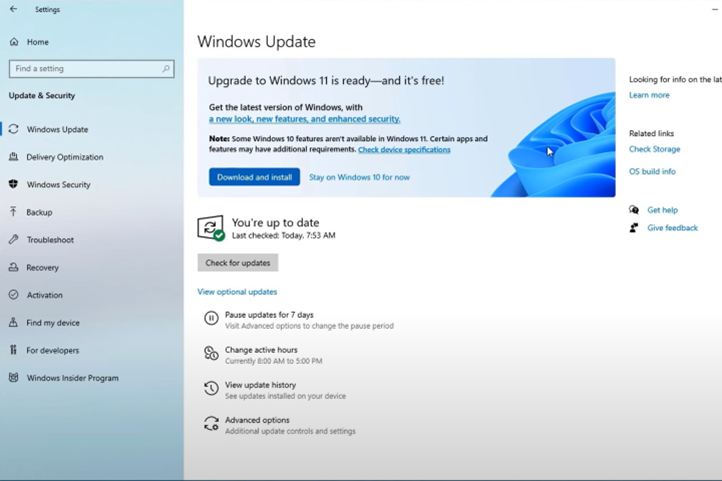
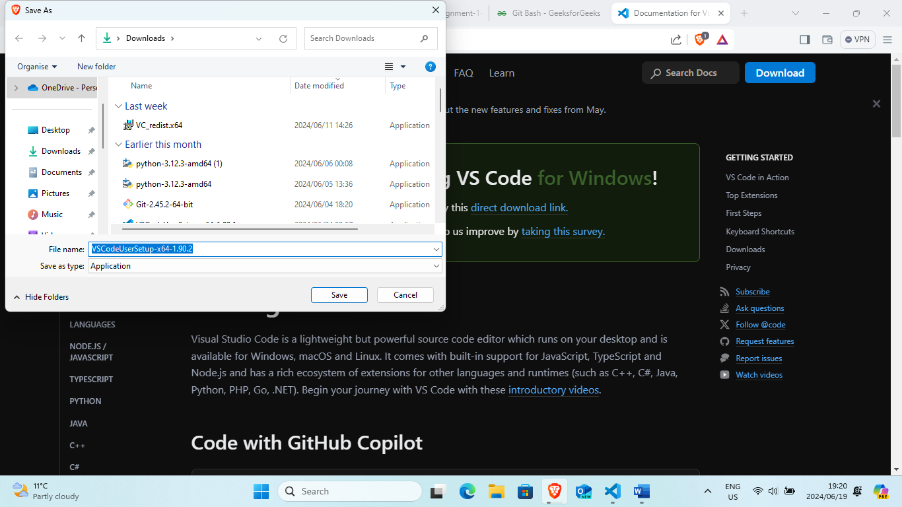
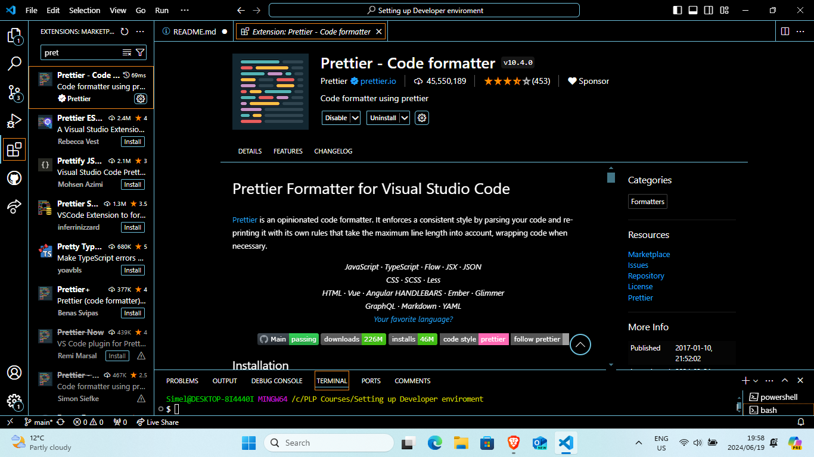
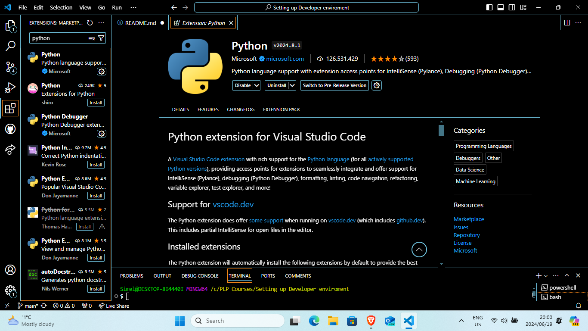
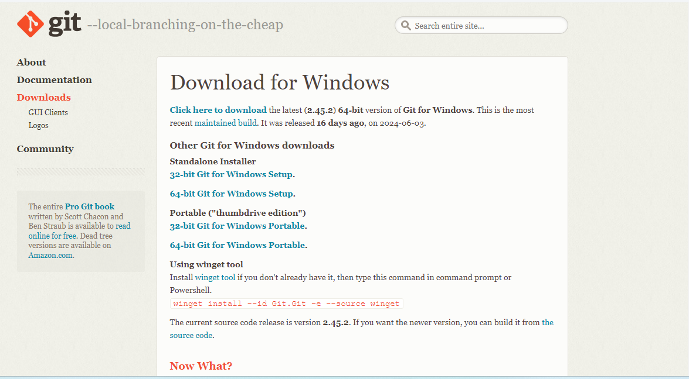
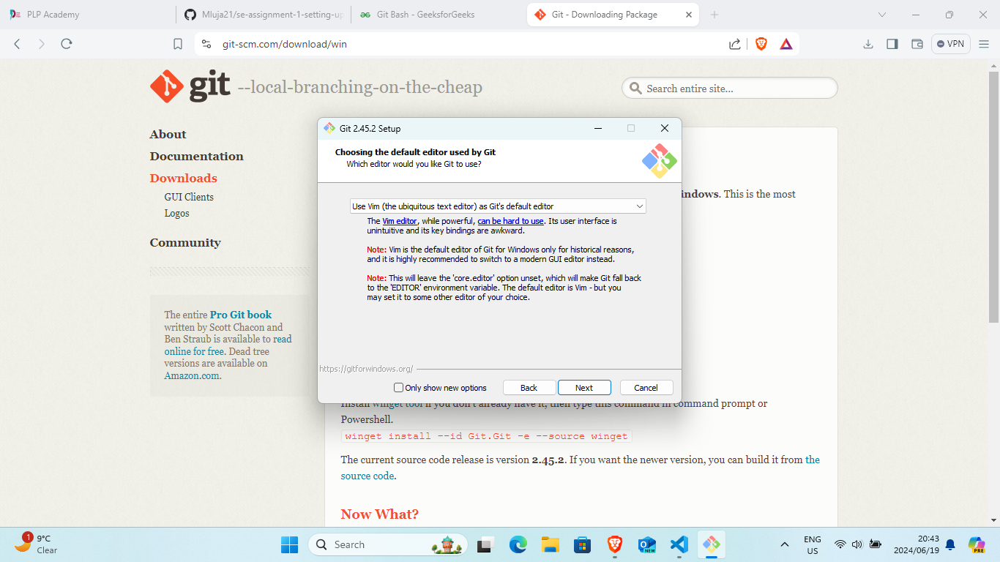

# Dev_Setup
Setup Development Environment

#Assignment: Setting Up Your Developer Environment

#Objective:
This assignment aims to familiarize you with the tools and configurations necessary to set up an efficient developer environment for software engineering projects. Completing this assignment will give you the skills required to set up a robust and productive workspace conducive to coding, debugging, version control, and collaboration.

#Tasks:

1. Select Your Operating System (OS):
   Choose an operating system that best suits your preferences and project requirements. Download and Install Windows 11. https://www.microsoft.com/software-download/windows11
# Steps:
1. Went to Settings from the search bar on the screen.
2. Under the Windows Update tab in the settings program.
3. Clicked on the install Windows 11 system option on the screen.

4. Took more then 6-7 hours to download and install. No challenges were encountered.

2. Install a Text Editor or Integrated Development Environment (IDE):
   Select and install a text editor or IDE suitable for your programming languages and workflow. Download and Install Visual Studio Code. https://code.visualstudio.com/Download
# Steps:
1. Typed in 'Visual Studio code' in the search bar of Brave browser and clicked on the first website.
2. I clicked on the download button and was taken to a webpage, allowing me to choose between Windows,Linux and Macos
3. I chose windows and then this popup came, allowing me to choose where to store Vscode within my laptop. 

4. Chose downloads and the program proceeded to be downloaded.
5. I opened the program in downloads after it was downloaded. 
6. Then proceeded to follow the installation wizard,and did not change anything.
7. Once setup was complete,opened up Vscode. Proceeded to go to extensions and installed two extensions.
8. I installed Python and Prettier(this is a code formatter extension ).Both extensions were verified extensions.
   
9. No challenges were met.

3. Set Up Version Control System:
   Install Git and configure it on your local machine. Create a GitHub account for hosting your repositories. Initialize a Git repository for your project and make your first commit. https://github.com
# Steps: 
1. I searched up git in my Brave browser and clicked on the 'www.git-scm.com'
2. Then clicked on the download for windows options, then it took me to a webpage to download the latest version.

3. After it finished downloading, started the installation process through the installation process.  
4. I did not change anything during the installation wizard except when it came to choosing defualt editor.
# Challenges:
5. first time setting git up after the first software engineering lesson, where we were instructed to use Notepad++ as the default editor. 
6. After trying to use Notepad++, while folowing the class, I saw it gave me to many issues, therefor, I deleted it.
7. After deleting, I reinstalled it and used vim as the default editor and it hasn't given me much issues.

8. I then proceededed to finish off the installation without issues. 
 # Steps for Github account: 
1. Search for 'github.com' and then click on the create account.
2. Then follow the prompts needed to create the account on GitHub. 
3. Then click on the new repository button on the left side of the website under the heading, "Top Repositories' 
4. There'll be a green icon,click on it to create a new repository. 
4. Then typed in a repository name and description and kept the rest of the settings the same. 
5. Clicked create and a new Repository was created.   
# Steps for Gitbash:
1. Open and run Gitbash as administrator. 
2. 

4. Install Necessary Programming Languages and Runtimes:
  Instal Python from http://wwww.python.org programming language required for your project and install their respective compilers, interpreters, or runtimes. Ensure you have the necessary tools to build and execute your code.

5. Install Package Managers:
   If applicable, install package managers like pip (Python).
   # Steps:
   1. I installed it within Gitbash.
   2. I used the command line "python -m pip install virtualenv"
   
6. Configure a Database (MySQL):
   Download and install MySQL database. https://dev.mysql.com/downloads/windows/installer/5.7.html
   # Steps for installing MYSQL:
   1. I installed MYSQL from the website and waited for it to finish downloading. 
   2. Then proceeded to followthe installation process. 
   3. Under "Choose a setup type', i chose Full to downalod all packages needed.
   4. i then metup with an error that required me to manually go download Microsoft Visual C++ 2019 Redristribution.
   5. After downloading that, all the errors under the Check Requirements tab disappeared, I continued with the setup process.
   6. Even creating a password for MYSQL, after following the relevant steps, MYSQL Workbench and MYSQL Command line came up.

7. Set Up Development Environments and Virtualization (Optional):
   Consider using virtualization tools like Docker or virtual machines to isolate project dependencies and ensure consistent environments across different machines.
# steps: 
1. I did not download any virtualisation software.   

8. Explore Extensions and Plugins:
   Explore available extensions, plugins, and add-ons for your chosen text editor or IDE to enhance functionality, such as syntax highlighting, linting, code formatting, and version control integration.
# steps: 
1. Under the extensions tab, I installed Prettier(which is a code formatter). 
2. Another extension, I installed BlackBox.Ai, this was an extension that would help with the code. 
9. Document Your Setup:
    Create a comprehensive document outlining the steps you've taken to set up your developer environment. Include any configurations, customizations, or troubleshooting steps encountered during the process. 

#Deliverables:
- Document detailing the setup process with step-by-step instructions and screenshots where necessary.
- A GitHub repository containing a sample project initialized with Git and any necessary configuration files (e.g., .gitignore).
- A reflection on the challenges faced during setup and strategies employed to overcome them.

#Submission:
Submit your document and GitHub repository link through the designated platform or email to the instructor by the specified deadline.

#Evaluation Criteria:**
- Completeness and accuracy of setup documentation.
- Effectiveness of version control implementation.
- Appropriateness of tools selected for the project requirements.
- Clarity of reflection on challenges and solutions encountered.
- Adherence to submission guidelines and deadlines.

Note: Feel free to reach out for clarification or assistance with any aspect of the assignment.
